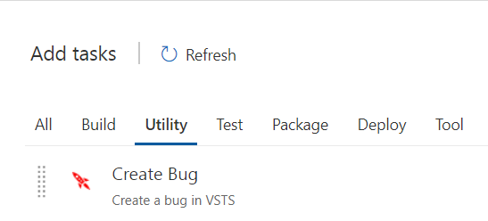
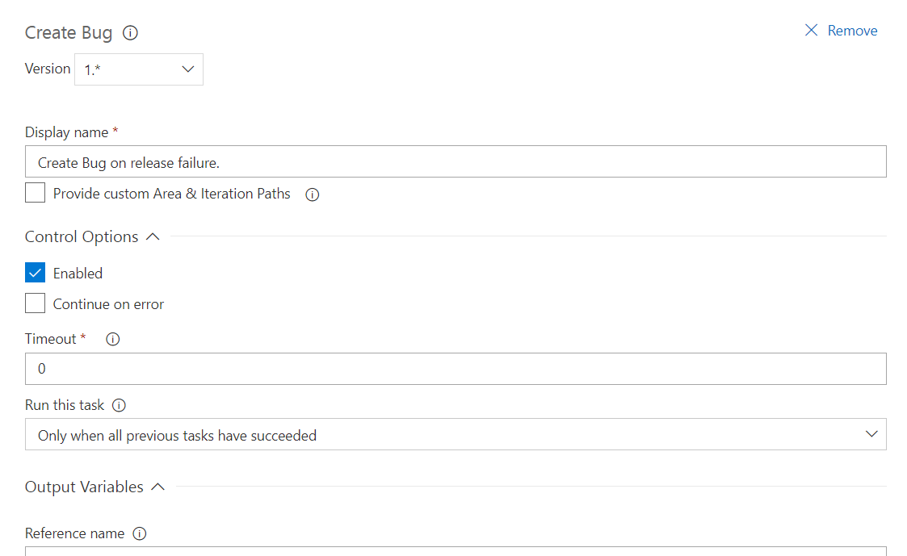

# CreateBug-VSTS-Task

Dynamically creates a bug (work item) in current or custom defined area & iteration path for the team project in VSTS on release failure with details like repro steps, errors, description, title, priority, severity & assigns it to the person who triggered the release.

## Requirements

The task requires access to OAuth token in order to get error details for a release and create a bug in VSTS.
* Please enable "Allow scripts to access OAuth token" flag in in Agent Phase -> Additional options (as shown below).

## How to use

The task can be added at any step in the release pipeline.

It can be added to the same phase(single phase pipeline) or a different phase in a release pipeline (multi-phase pipeline).The recommended approach for either case is covered in the following steps.

1. Add the task
* Goto "Add Task to Agent phase" and add task from utility tab in the desired release pipeline.

2. Configure the task
* The task can be used as is without any configuration provided.
* The default behaviour will add the bug to default area and iteration path setting of the team project to which the release definition belongs to.

* In order to override the default area and iteration path select the "Custom Area & Iteration Paths" option.
* This will enable required settings for "Area Path" & "Iteration Path". Provide the custom paths as shown in the screenshot, the bug will be created against the same.

3. Stand-alone step (recommended for single phase pipelines)
* In a single phase release pipeline add the task after all the deployment tasks.
* Ensure that "Run this task" setting for the task is set to "Only when a previous task has failed". This enables task will be able to get error logs from all the tasks in  the release pipeline which have failed in the current environment.
* The same strategy can be applied to all release pipelines of different environments in the release definition so that the bug for each environment failure has consolidated report of error logs from all failed environments up-to that point.

4. Multi-Phase configuration (recommended for multi-phase pipelines)
* In a multi-phase pipeline where the release pipeline has various deployment phases, add another phase after the deployment phases to run the task.
* Also ensure that the "Run This Phase" setting for the phase (containing the task) is set to "Only when a previous phase has failed". This enables the task will be able to get error details for all the deployment phases in the failed environments.
* The same strategy can be applied to all release pipelines of different environments in the release definition so that the bug for each environment failure has consolidated report of error logs from all failed environments up-to that point.

