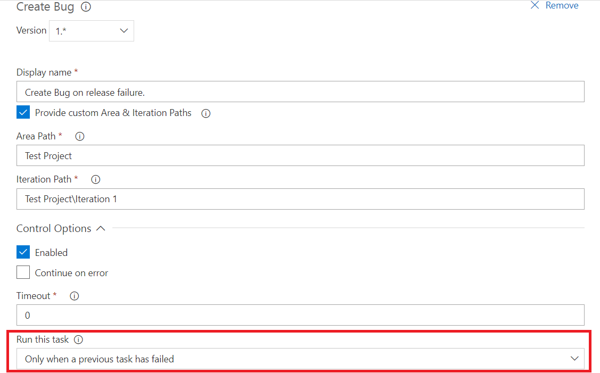
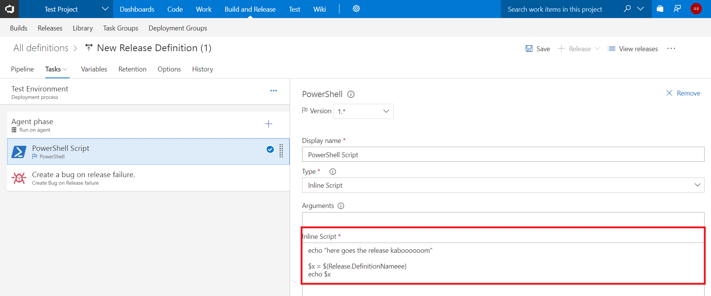
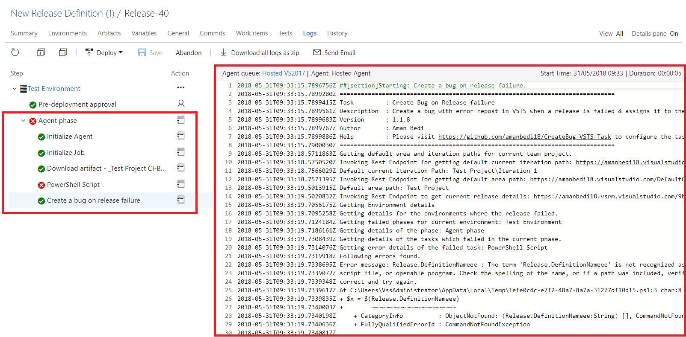

# CreateBug-VSTS-Task

Dynamically creates a bug (work item) in current or custom defined area & iteration path for the team project in VSTS on release failure with details like repro steps, errors, description, title, priority, severity & assigns it to the person who triggered the release.

## Requirements

The task requires access to OAuth token in order to get error details for a release and create a bug in VSTS.
* Please enable "Allow scripts to access OAuth token" flag in in Agent Phase -> Additional options (as shown below).

## How to use

The task can be added at any step in the release pipeline.

It can be added to the same phase(single phase pipeline) or a different phase (multi-phase pipeline). The recommended approach for either case is covered in the following steps.

1. Add the task
* Goto "Add Task to Agent phase" and add task from utility tab in the desired release pipeline.

2. Configure the task
* The task can be used as is without any configuration provided.
* The default behaviour will add the bug to default area and iteration path setting of the team project to which the release definition belongs to.

* In order to override the default area and iteration path select the "Custom Area & Iteration Paths" option.
* This will enable required settings for "Area Path" & "Iteration Path". Provide the custom paths as shown in the screenshot, the bug will be created against the same.

3. Stand-alone step (single phase pipelines)
* In a single phase release pipeline add the task after all the deployment tasks.
* Ensure that "Run this task" setting for the task is set to "Only when a previous task has failed". This enables the task able to get error logs from all the tasks in the release pipeline which have failed in the current environment.
* The same strategy can be applied to all release pipelines of different environments in the release definition so that the error's from failed steps in each environment's release pipeline can be consolidated in final error report for the bug.

4. Multi-Phase configuration (multi-phase pipelines)
* In a multi-phase pipeline where the release pipeline has various deployment phases, add another phase after the deployment phases to run the task.
* Also ensure that the "Run This Phase" setting for the phase (containing the task) is set to "Only when a previous phase has failed". This enables the task will be able to get error details for all the deployment phases in the failed environments.
* The same strategy can be applied to all release pipelines of different environments in the release definition so that the error's from failed steps in each environment's release pipeline can be consolidated in final error report for the bug.

## Sample Runs

Below are sample runs to showcase the task for both single phase and multi phase pipelines. For demo purpose there is only one environment in the release definition but in actual practice, the task will consolidate error logs for all environments that have been executed before the task's execution and have failed phases due to errors in tasks.

### Single Phase Release pipeline

1. Below is a single phase release pipeline having 2 steps:
* An inline PowerShell script execution step which is rigged to blow the release:

* The "Create a bug on release failure" step as the last step in the release pipeline with "Run this task" set to "Only when a previous task has failed"

2. On executing a release, the Release fails on the "PowerShell Script" step as a result the "Create a bug on release failure" task executes as configured by "Run this task" property. 
* The task gets the default area and iteration path for the Team Project against which the release was made. 
* It scans through the release, gets all failed environments upto this point, gets all failed phases & tasks in each failed phase and errors for each such task to consolidate the same into an error report.
* The same is written to the host in the logs window

3. Finally the bug is created with environment and build details in the title, consolidated error report, severit & priority, under default area and iteration path, assigned to the person who triggered the release.

### Multi Phase Release pipeline
